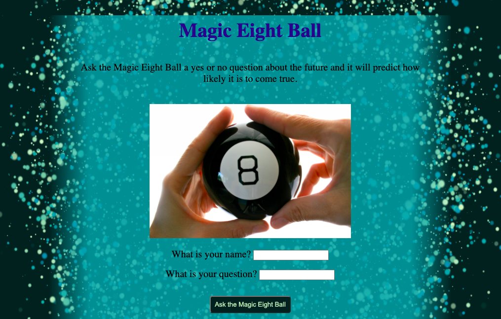

# Magic Eight Ball

A mini project inspired by codecademy after following their Magic Eight Ball task. 

Ask the magic Eight Ball a question and it will predict how likely it is to be true.

Link to live site: https://georginacarlisle.github.io/mini-project-eightBall/

## Credits

#### Code
Credit for the idea behind this project and some of the JavaScript goes to [Codecademy](https://www.codecademy.com/)
#### Images
magic-eight-ball : Credit to [Candace McDaniel](https://stocksnap.io/author/candacemcdaniel)

background-magic : Credit to [Vidsplay](https://stocksnap.io/author/vidsplay)

## Acknowledgements

[Sticky Footer article by CSS-Tricks](https://css-tricks.com/couple-takes-sticky-footer/) - Used to explore and test out ways to create a sticky footer.
[Flexbox article by CSS-Tricks](https://css-tricks.com/snippets/css/a-guide-to-flexbox/) - Used to recap knowledge on flex.
[linear-gradient article by mdn web docs](https://developer.mozilla.org/en-US/docs/Web/CSS/gradient/linear-gradient) - Used to learn how to impliment a linear-gradient